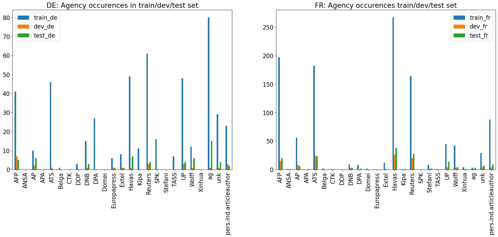

## Classification and Exploration of News Agency Content

[](https://doi.org/10.5281/zenodo.8333933)
[](https://www.python.org/) 
[](https://pytorch.org/docs/1.13/) 
[](LICENSE)

This repository holds the code related to the master project of Lea Marxen on the classification and exploration of news agency content, based on the _impresso_ corpus ([Report](https://infoscience.epfl.ch/record/305129?&ln=en)). 
The project was implemented in the summer semester 2023, with the supervision of Maud Ehrmann, Emanuela Boros and Marten Düring.

## About

Since their beginnings in the 1830s and 1840s, news agencies have played an important role in the national and international news market, aiming to deliver news as fast and as reliable as possible. While we know that newspapers have been using agency content for a long time to produce their stories, the amount to which the agencies shape our news often remains unclear. Although researchers have already addressed this question, recently by using computational methods to assess the influence of news agencies at present, large-scale studies on the role of news agencies in the past continue to be rare.

This project aims to bridge this gap by detecting news agencies in a large corpus of Swiss and Luxembourgish newspaper articles (the impresso corpus) for the years 1840-2000 using deep learning methods. For this, we first build and annotate a multilingual dataset with news agency mentions, which we then use to train and evaluate several BERT-based agency detection and classification models. Based on these experiments, we choose two models (for French and German) for the inference on the impresso corpus.


## Research Summary

Results show that ca. 10% of the articles explicitly reference news agencies, with the greatest share of agency content after 1940, although systematic citation of agencies already started slowly in the 1910s.
Differences in the usage of agency content across time, countries and languages as well as between newspapers reveal a complex network of news flows, whose exploration provides many opportunities for future work.

## Organization

- `annotation_settings/`: Contains the planning and settings for annotation with Inception.
  - `inception_settings/`: Contains specifications for inception settings, e.g. the TypeSystem and tagset.
  - `Annotation Guidelines for Newsagency Classification v2.pdf`
  - `annotation_planning_per_annotator.csv`
  - `annotation_planning_per_doc.csv`
- `data/`: Contains part of the data used during the project.
  - `annotation/`
  - `sampling/`
  - `split/`
- `lib/`: Contains python scripts for the classification and the conversion of data (before and after annotation in Inception).
  - `bert-classification/`: Contains the text classification model as well as the code for its application on the _impresso_ corpus.
  - `inception_postprocessing/`
  - `inception_preprocessing/`
- `notebooks/`: Contains the notebooks used in the creation of the training corpus, annotation and analysis.
  - `1_sampling_training_data/`
  - `2_annotation/`
  - `3_classification/`
  - `4_analysis/`
- `report/`: Contains the report of the master project (Pdf and Zip for Latex).

## Installation and Usage

The project uses `python 3.10`. The dependencies for running the code can be found in `requirements.txt`. If only the classification is required, it suffices to install the dependencies specified in `lib/bert-classification/requirements_classification.txt`.


### Text Classification 

The model is based on `AutoModelForSequenceClassification` provided by the `transformers` library and it is a generic model class that will be instantiated as one of the sequence classification model classes of the library when created with the `from_pretrained(pretrained_model_name_or_path)` method.

The classification baseline has three modes:
- binary classification: is there any news agency mentioned in the text or not
- multiclass classification: a text can only belong to a news agency
- multiclass and multilabel classification: a text can belong to several news agencies

Additional to the in-model evaluation, the [HIPE-scorer](https://github.com/hipe-eval/HIPE-scorer) can be downloaded for evaluation on the task of named entity recognition. It provides the possibility to evaluate on different time periods and OCR-levels. In order for the latter to work, we changed ``row["MISC"]`` to ``row["OCR-INFO"]`` in line 200 of ``HIPE-scorer/hipe_evaluation/utils.py``.

The two fine-tuned models used for inference on the _impresso_ corpus are released on [Zenodo](https://doi.org/10.5281/zenodo.8333933).


## Dataset

The annotated dataset is released on [Zenodo](https://doi.org/10.5281/zenodo.8333933). It contains historical newspaper articles with annotations of news agency mentions. The articles are divided into French (fr) and German (de) subsets and a train, dev and test set respectively. The data is annotated at token-level in the CoNLL format with IOB tagging format.

|           |  **Lg.**  | **Docs** | **Tokens** | **Agency Mentions** |
|:----------| :-------- | -------: | ---------: | ------------------: |
| **Train** | de        |      333 |    247,793 |                 493 |
|           | fr        |      903 |    606,671 |               1,122 |
| Total     |           |    1,236 |    854,464 |               1,615 |
| **Dev**   | de        |       32 |     28,745 |                  26 |
|           | fr        |      110 |     77,746 |                 114 |
| Total     |           |      142 |    106,491 |                 140 |
| **Test**  | de        |       32 |     22,437 |                  58 |
|           | fr        |      120 |     75,057 |                 163 |
| Total     |           |      152 |     97,494 |                 221 |
| **All**   | de        |      397 |    298,975 |                 577 |
|           | fr        |    1,133 |    759,474 |               1,399 |
| Total     |           |    1,530 |  1,058,449 |               1,976 |


Due to an error, there are seven duplicated articles in the French test set (article IDs: courriergdl-1847-10-02-a-i0002, courriergdl-1852-02-14-a-i0002, courriergdl-1860-10-31-a-i0016, courriergdl-1864-12-15-a-i0005, lunion-1860-11-27-a-i0004, lunion-1865-02-05-a-i0012, lunion-1866-02-16-a-i0009).

The dataset contains the following newsagencies:




#### Example:

```
# global.columns = TOKEN NE-COARSE-LIT NE-COARSE-METO NE-FINE-LIT NE-FINE-METO NE-FINE-COMP NE-NESTED NEL-LIT NEL-METO RENDER SEG OCR-INFO MISC
# language = fr
# newspaper = EXP
# date = 1924-03-27
# document_id = EXP-1924-03-27-a-i0077
# news-agency-as-source = Q2826560
# segment_iiif_link = https://impresso-project.ch/api/proxy/iiif/EXP-1924-03-27-a-p0005/224,107,285,87/full/0/default.jpg
POLITIQUE O	    O	    O	    O	    O	    O	    _	    _	    EndOfLine	    _   	_   	_
# segment_iiif_link = https://impresso-project.ch/api/proxy/iiif/EXP-1924-03-27-a-p0005/129,269,488,53/full/0/default.jpg
LONDRES   O	    O   	O   	O   	O   	O   	_	    _   	NoSpaceAfter	_	    _	    _
,	        O	    O	    O   	O   	O   	O   	_   	_ 	  _ 	  _	    _   	_
27	      O	    O	    O	    O   	O   	O	    _   	_	    _	    _	    _   	_
(	        O	    O	    O	    O   	O   	O   	_	    _     NoSpaceAfter	_	    _   	_
Havaa	    B-org	  O	    B-org.ent.pressagency.Havas	  O   	O   	O   	Q2826560	_	    NoSpaceAfter	_	    Transcript:Havas|LED0.20	  _
)	        O	    O	    O   	O   	O	    O	    _   	_	    NoSpaceAfter	_   	_	    _
.	        O	    O   	O	    O   	O   	O	    _	    _	    _	    EndOfSentence	    _	    _

...
```

This article contains the newsagency `Havas` and thus its WikiID `Q2826560` appears on article-level (`# news-agency-as-source`).

## License

newsagency-classification - Lea Marxen    
Copyright (c) 2023 EPFL    
This program is licensed under the terms of the MIT. 
